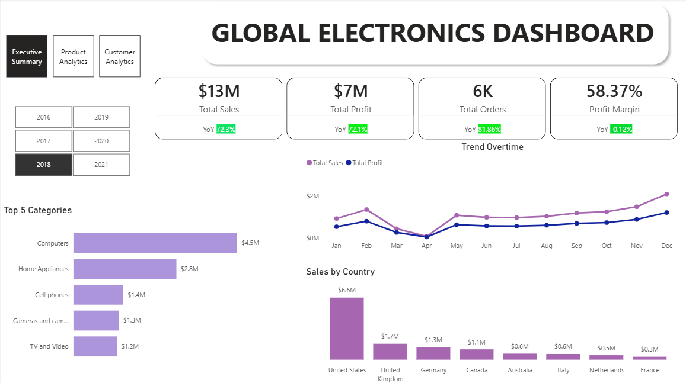
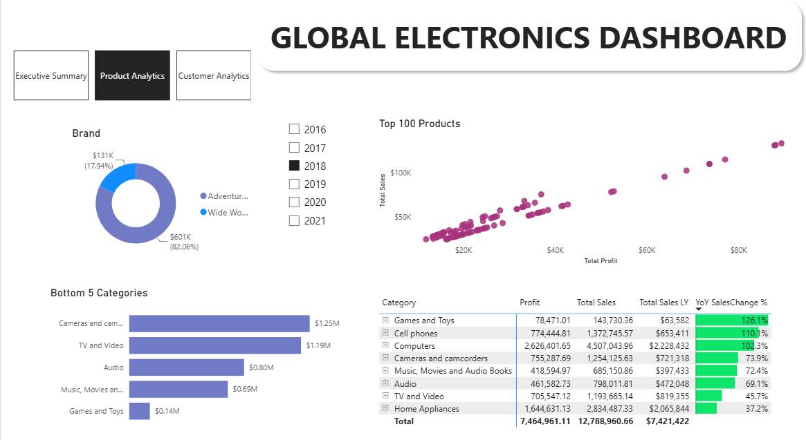
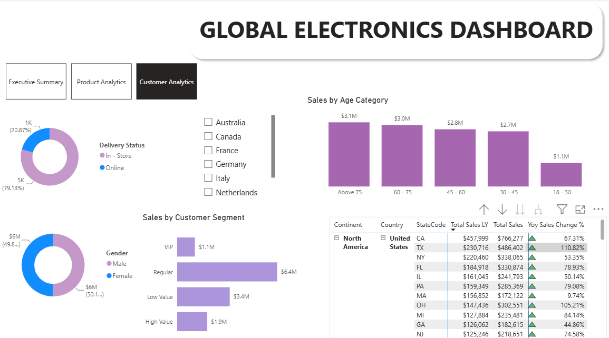

# 📊 Global Electronics Sales Analytics Dashboard

An end-to-end Data Analytics project that demonstrates the complete analytics workflow—from building a SQL Server data warehouse using the Medallion Architecture to developing an interactive Power BI dashboard for business insights.

---

## 🚀 Project Overview

This project analyzes sales data for a global electronics retailer to provide actionable business insights through interactive dashboards. The solution includes:

- Data ingestion from CSV files
- ETL pipeline using SQL Server
- Data quality checks and transformation
- Medallion Architecture (Bronze → Silver → Gold)
- Star Schema data model
- Power BI dashboard with DAX measures and time intelligence

---

## 🏗️ Project Architecture

```
CSV Files
     │
     ▼
Bronze Layer (Raw Data)
     │
     ▼
Silver Layer (Clean & Transformed Data)
     │
     ▼
Gold Layer (Business-Ready Data Warehouse)
     │
     ▼
Power BI Data Model
     │
     ▼
Interactive Dashboard
```

---

## 🛠️ Technologies Used

| Technology | Purpose |
|------------|---------|
| SQL Server | Database & ETL |
| T-SQL | Data Transformation |
| Power BI | Dashboard Development |
| DAX | Business Calculations |
| Git & GitHub | Version Control |

---

# 📂 Repository Structure

```
Global-Electronics-Analytics/
│
├── Datasets/
│   ├── Customers.csv
│   ├── Data_Dictionary.csv
│   ├── ExchangeRates.csv
│   ├── Products.csv
│   ├── Sales.csv
│   └── Stores.csv
│
├── SQL/
│   ├── 01_Create_Database.sql
│   ├── 02_Create_Bronze.sql
│   ├── 03_Load_Bronze.sql
│   ├── 04_Quality_Checks.sql
│   ├── 05_Create_Silver.sql
│   ├── 06_Quality_Checks.sql
│   ├── 07_Load_Silver.sql
│   ├── 08_Create_Gold.sql
│   └── 09_Load_Gold.sql
│
├── Power BI/
│   ├── GlobalElectronics.pbix
│   ├── DAX_Measures.md
│   └── Data_Model.png
│
├── Dashboard_Screenshots/
│   ├── Executive_Summary.png
│   ├── Product_Analytics.png
│   └── Customer_Analytics.png
│
└── README.md
```

---

# 🗄️ SQL Data Warehouse

The data warehouse follows the **Medallion Architecture**, separating data into Bronze, Silver, and Gold layers.

## Bronze Layer

- Raw data ingestion from CSV files
- Stores unprocessed source data

## Silver Layer

- Data cleaning and transformation
- Data type conversion
- Duplicate checks
- Null value handling
- Data standardization

## Gold Layer

- Analytics-ready star schema
- Fact and dimension tables
- Business metrics calculated during ETL

---

# 📈 Power BI Dashboard

The Power BI report consists of **three interactive pages**.

## 1️⃣ Executive Summary

### KPI Cards

- Total Sales
- Total Profit
- Total Orders
- Profit Margin

### Visuals

- Sales by Country
- Sales & Profit Trend
- Top 5 Categories
- Year Slicer
- Navigation Buttons

---

## 2️⃣ Product Analytics

### Visuals

- Top 100 Products Scatter Plot
- Category Performance Matrix
- Sales by Brand
- Bottom 5 Categories
- Year Slicer

### Metrics

- Total Sales
- Previous Year Sales
- Profit
- YoY Sales Growth

---

## 3️⃣ Customer Analytics

### Visuals

- Sales by Age Category
- Customer Segment Analysis
- Sales by Gender
- Delivery Status
- Country Performance Matrix
- Country Slicer

---

# 📊 Data Model

The Power BI report uses a **Star Schema** consisting of:

### Fact Table

- Fact_Sales

### Dimension Tables

- Dim_Customers
- Dim_Products
- Dim_Stores
- Dim_Date
- Dim_ExchangeRates

---

# 📐 DAX Measures

Key business measures include:

- Total Sales
- Total Cost
- Total Profit
- Profit Margin
- Total Orders
- Total Sales LY
- Total Profit LY
- YoY Sales Growth %
- YoY Profit Margin %
- YoY Orders

Additional calculated columns:

- Customer Segment
- Customer Age
- Age Category

---

# 📸 Dashboard Preview

## Executive Summary



---

## Product Analytics



---

## Customer Analytics



---

# 💡 Business Insights

This dashboard enables users to answer questions such as:

- Which countries generate the highest revenue?
- Which products are the top performers?
- Which categories contribute the highest profit?
- How has sales performance changed compared to last year?
- Which customer segments drive the most revenue?
- How do customer demographics influence sales?

---

# 🎯 Skills Demonstrated

- SQL Server
- ETL Development
- Data Warehousing
- Medallion Architecture
- Data Cleaning
- Data Quality Validation
- Star Schema Design
- Power BI
- DAX
- Time Intelligence
- Business Intelligence
- Data Visualization
- Git & GitHub

---

# 📬 Contact

**Ijas Ahamed**

- LinkedIn: https://www.linkedin.com/in/ijas-ahamed-a134aa123/
- GitHub: https://github.com/your-username

If you found this project useful, feel free to ⭐ the repository!
