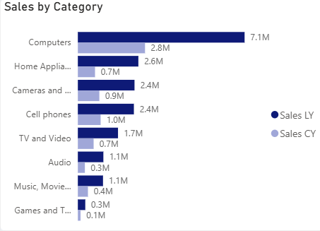
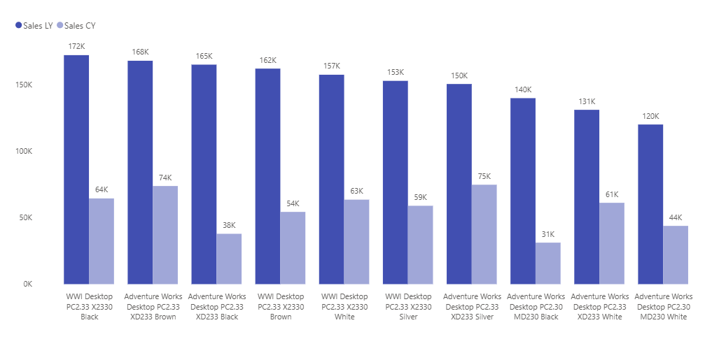
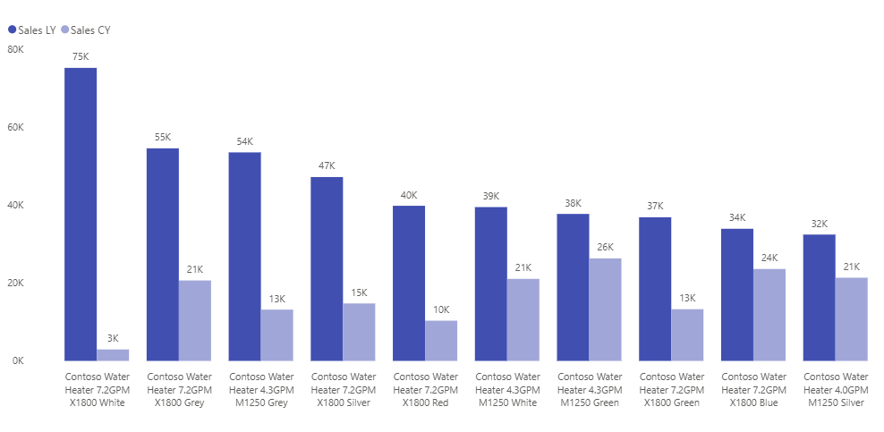
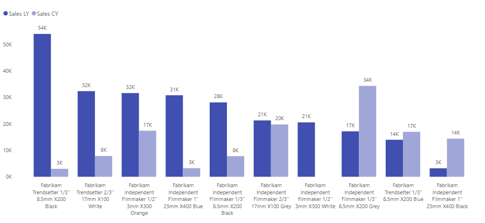
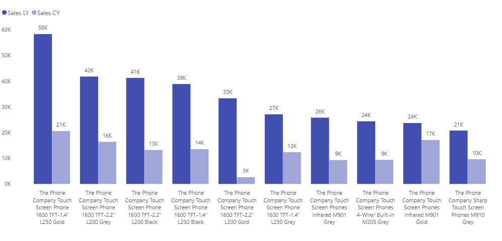
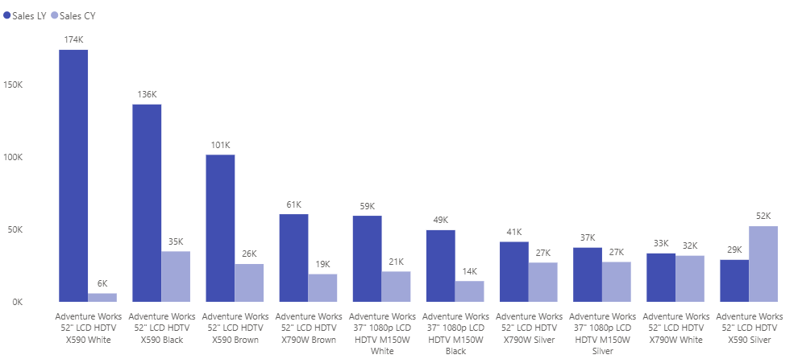
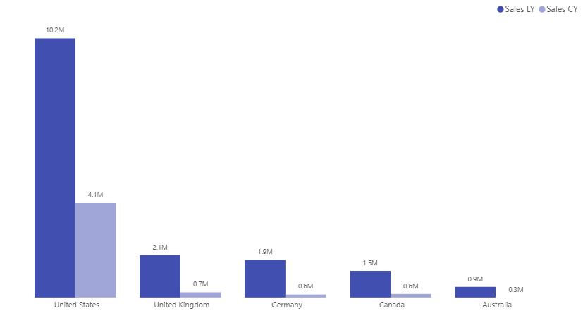
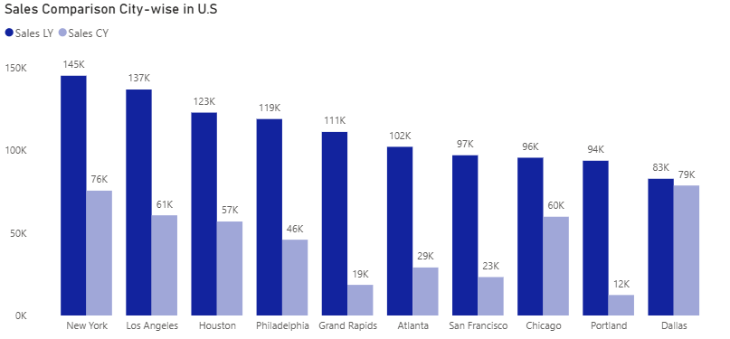
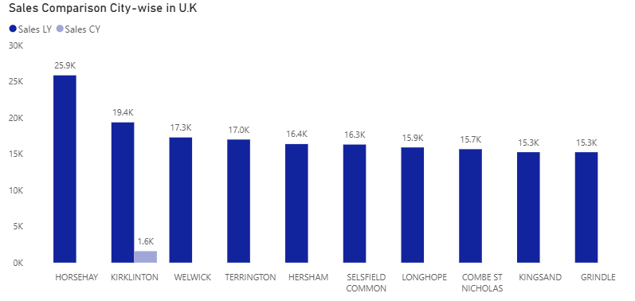

# 📊 Global Electronics Sales Analytics Dashboard

## 📌 Project Overview

**Global Electronics Sales Analytics Dashboard** is an end-to-end **Data Analytics and Business Intelligence project** built to analyze the sales performance of a Global Electronics retailer.
Global Electronics is a retail business with a diversified product portfolio and an international customer base. The company operates across multiple product categories, countries, and geographic markets.

**Computers are the company's strongest category, contributing roughly one-third of revenue**. Together, Computers and Home Appliances account for more than half of the company's total revenue, making these categories particularly important when evaluating overall business performance.

Global Electronics operates across multiple geographic markets, with sales distributed across North America, Europe, and Australia.

North America is the company's largest geographic market, generating approximately $34.60M in revenue. **The United States is the largest individual country market**, contributing approximately $29.87M, while Canada contributes approximately $4.72M.

The business is experiencing a **significant year-over-year decline in sales**, particularly in the most recent periods. This project focuses on understanding **where the decline is happening, which products and markets are most affected, how customer behavior is changing, and where the business can focus its recovery efforts**.

## 🎯 Business Problem

Global Electronics has experienced a substantial decline in sales performance compared with previous years.

Management needs to understand:

* How severe is the sales decline?
* When did the decline become significant?
* Which product categories are contributing to the decline?
* Which products and brands are losing sales?
* Which countries and markets are most affected?
* How has customer purchasing behavior changed?
* Is the decline affecting profitability?
* Which areas should management prioritize for recovery?

This dashboard provides a centralized analytical view to help answer these questions.

---

# 📈 Key Business Insights

### 🔻 Significant Year-over-Year Sales Decline

Sales performance has weakened considerably compared with previous years.

Key Note: Dataset is available for period Jan 2016- Feb 2021

* **2020 sales were approximately 49% lower than 2019**


 

* The latest 12-month period, **March 2020–February 2021**, generated approximately **$6.9M** compared with **$18.5M** in the previous comparable 12-month period.
* This represents an approximate **62% year-over-year decline** in the latest 12-month period.


* **January–February 2021 sales were approximately 75% lower than January–February 2020**
  


The trend indicates that the decline is not limited to a single month or isolated period, making further analysis of products, customers, and markets important.

### 📦 Product & Category Performance

  The overall sales decline becomes more meaningful when performance is examined at the category level.

**Computers are the company's strongest category, contributing roughly one-third of total revenue. Together, Computers and Home Appliances account for more than half of total revenue.**
   
   Because these categories represent a large share of the company's revenue, their year-over-year performance has a significant impact on the overall business


**Category-Level Sales Decline**

Comparing current-year sales with the equivalent previous-year period shows that the decline is broad-based across major product categories.

The largest decline in absolute sales value came from Computers. Sales decreased from approximately $7.10M to $2.84M, resulting in a loss of approximately $4.26M in revenue.

* Computers: largest business impact because of its high revenue base and approximately $4.26M decline.
* Home Appliances: significant decline of approximately $1.87M.
* Cameras & Camcorders: approximately $1.50M decline.
* Cell Phones: approximately $1.44M decline.
* Audio: highest percentage decline, but a smaller absolute revenue impact.




### 🔎 Product Performance

The category-level analysis identifies where the largest revenue declines are occurring. To understand **what is driving those category-level declines**, product performance was analyzed across the five highest-revenue categories: **Computers, Home Appliances, Cameras & Camcorders, Cell Phones, and TV & Video.**

The analysis focuses on the **top five products within each major category.** 
The comparison shows that the decline in overall sales is reflected across many of the highest-performing products within the major categories.

**Computers:** The category experienced the largest absolute sales decline, and its leading products contributed significantly to this reduction. WWI Desktop PC2.33 X2330 Black decreased from approximately $172K to $64K, a decline of $108K (-62.8%). Adventure Works Desktop PC2.33 XD233 Black declined from $165K to $38K, a reduction of $127K (-77.0%). This indicates that the decline in Computers was not driven by a single product but was spread across several major desktop products.





**Home Appliances:** The leading products also experienced substantial declines. Contoso Water Heater 7.2GPM X1800 White fell from approximately $75K to $3K, a reduction of $72K (-96.0%). Contoso Water Heater 7.2GPM X1800 Grey declined from $55K to $21K, down $34K (-61.8%). These declines help explain the significant year-over-year reduction observed in the Home Appliances category.




**Cameras & Camcorders:** The category shows a more mixed pattern. Several leading products declined sharply, including Fabrikam Trendsetter 1/3" 8.5mm X200 Black, which fell from approximately $54K to $3K, a decline of $51K (-94.4%). However, some products performed better than the previous year. Fabrikam Independent Filmmaker 1/3" 8.5mm X200 Grey increased from $17K to $34K, an increase of $17K (+100%). This suggests that the category decline was concentrated among specific products rather than being uniform across the entire category.





**Cell Phones:** The leading phone products show a broad downward trend. The Phone Company Touch Screen Phone 1600 TFT-2.2" L200 Black declined from approximately $33K to $3K, a reduction of $30K (-90.9%). Other leading Touch Screen Phone models also experienced significant declines, indicating that weaker product-level performance was an important contributor to the category's overall decline.





**TV & Video:** The category shows some of the most significant product-level reductions. Adventure Works 52" LCD HDTV X590 White decreased from approximately $174K to $6K, a reduction of $168K (-96.6%). The Black version declined from $136K to $35K, down $101K (-74.3%). These large reductions among high-revenue products help explain the substantial decline observed within the category.





Overall, the product-level analysis shows that the sales decline was not caused by a single product. Instead, multiple high-performing products across the major categories experienced substantial year-over-year reductions.

The analysis also reveals important exceptions, particularly within Cameras & Camcorders, where several products increased their sales despite the broader category decline. This highlights an opportunity to investigate what differentiates these better-performing products from those experiencing significant declines.

This drill-down connects the analysis from category performance to individual product performance, helping identify the products that contributed most to the company's overall sales decline and providing a starting point for deeper investigation into potential drivers such as product demand, pricing, availability, or product mix.


### 🌍 Geographic Performance

Geographic analysis was used to understand how sales performance changed across the company's major markets and to identify the cities contributing to these changes.

The analysis follows a Country → City drill-down approach. The country-level analysis first compares Current-Year (CY) Sales against Last-Year (LY) Sales across the major markets. The analysis then moves deeper into individual countries to understand city-level performance and identify both declining and emerging markets.

### 🌎 Sales Performance Across Major Countries

The following chart compares CY Sales against LY Sales across the company's major markets.

The comparison shows a significant decline across all five major markets:




The United States remained the largest market, with sales declining from $10.2M to $4.1M, a 59.8% YoY decline.

Germany experienced the largest percentage decline among these five markets, falling from $1.9M to $0.6M, representing a 68.4% decline.

The United Kingdom and Australia each declined by approximately 66.7%, while Canada declined by approximately 60.0%.

This country-level comparison establishes the overall geographic picture before moving into city-level analysis.

####  United States — Largest Market

The **United States is the company's largest market**, but sales declined from approximately **$10.2M last year to $4.1M in the current year**, representing a **59.8% YoY decline**.

The city-level analysis shows that the decline was widespread across several major U.S. markets.


Some of the largest city-level declines were:




Among these markets, **Portland experienced the sharpest decline at approximately 87.2%**, followed by **San Francisco at 76.3%** and **Atlanta at 71.6%**.

However, city-level performance also reveals important exceptions. **Dallas remained relatively stable**, declining only from $83K to $79K, or approximately **4.8%**. Meanwhile, **Baton Rouge increased from $20K to $33K**, representing approximately **65% growth**, and **Saginaw increased from $17K to $39K**, representing approximately **129.4% growth**.

This indicates that although the U.S. market experienced a significant overall contraction, performance varied considerably across individual cities.

####  United Kingdom

The **United Kingdom** was the second-largest market, with sales declining from approximately **$2.1M to $0.7M**, representing a **66.7% YoY decline**.

The city-level analysis reveals a significant change in the composition of sales. Several cities that generated sales last year recorded **zero current-year sales**, representing a **100% decline**:




At the same time, several cities generated current-year sales despite having no sales last year:


Because these cities had **zero LY sales**, a meaningful YoY percentage cannot be calculated. Instead, they represent **new current-year contributors**.

This suggests that the UK decline is accompanied by a **shift in the geographic composition of sales**, with some previously active cities disappearing while new cities emerge as contributors.

#### 🇩🇪 Germany

Germany experienced a decline from approximately **$1.9M to $0.6M**, representing a **68.4% YoY decline**.

The city-level analysis shows mixed performance:

| City        | LY Sales | CY Sales |  YoY Change |
| ----------- | -------: | -------: | ----------: |
| München     |     $34K |     $13K |  **-61.8%** |
| Nordestedt  |      $7K |      $9K |  **+28.6%** |
| Taufkirchen |     $18K |      $2K |  **-88.9%** |
| Weiden      |      $1K |     $18K | **+1,700%** |
| Schermbeck  |      $4K |     $15K |   **+275%** |

While major contributors such as **München and Taufkirchen declined sharply**, smaller markets including **Weiden and Schermbeck** recorded significant growth.

Weiden increased from $1K to $18K, although the very low LY base makes the percentage growth exceptionally large. This is a good example of why **absolute sales impact should be considered alongside YoY percentage change**.

Germany therefore demonstrates that an overall country-level decline can coexist with strong growth in individual cities.

#### 🇨🇦 Canada

Canada declined from approximately **$1.5M to $0.6M**, representing a **60% YoY decline**.

The largest Canadian markets experienced significant reductions:

| City      | LY Sales | CY Sales | YoY Change |
| --------- | -------: | -------: | ---------: |
| Toronto   |    $194K |     $99K | **-49.0%** |
| Vancouver |     $91K |     $25K | **-72.5%** |
| Calgary   |     $80K |     $13K | **-83.8%** |
| Montreal  |     $79K |     $59K | **-25.3%** |
| Ottawa    |     $45K |     $28K | **-37.8%** |
| Edmonton  |     $36K |     $15K | **-58.3%** |

However, smaller cities showed a different pattern:

* **Kitscoty:** $1K → $17K (**+1,600%**)
* **Gibsons:** $1K → $17K (**+1,600%**)
* **Welland:** $0 → $19K (**new current-year contributor**)

The Canadian market therefore shows a similar pattern to the U.S. and UK: **large established markets declined while some smaller markets emerged or grew.**

#### 🇦🇺 Australia

Australia declined from approximately **$0.9M to $0.3M**, representing a **66.7% YoY decline**.

Several cities that contributed meaningful sales last year recorded no current-year sales:

* **Doncaster East:** $26.7K → $0 (**-100%**)
* **Bandya:** $22.5K → $0 (**-100%**)
* **Castle Doyle:** $18.7K → $0 (**-100%**)

At the same time, new city-level contributions appeared in the current year:

* **Birdwoodton:** $0 → ~$14K
* **Gascoyne River:** $0 → ~$14K
* **Oberne Creek:** $0 → ~$14K

Since these cities had no LY sales, their YoY percentage change is **not meaningful**. They are better interpreted as **new current-year contributors**.

This suggests that Australia's decline is also associated with a **shift in the locations contributing to revenue**.

#### 🔎 Geographic Drillthrough Analysis

To investigate these patterns in greater detail, a **Country Performance drillthrough page** was created.

Selecting a country from the main geographic analysis allows the user to drill down into its individual cities and compare:

* **Current-Year Sales**
* **Last-Year Sales**
* **YoY % Change**


The drillthrough analysis helps answer two levels of business questions:

> **Which countries are contributing to the overall decline?**

and

> **Which cities within those countries are driving the change?**

The analysis also highlights an important distinction between **declining markets and emerging markets**. While most major markets experienced substantial reductions, some cities continued to grow or generated sales for the first time in the current year.

### 📊 Key Geographic Findings

| Market         | LY Sales | CY Sales | YoY Change |
| -------------- | -------: | -------: | ---------: |
| United States  |   $10.2M |    $4.1M | **-59.8%** |
| United Kingdom |    $2.1M |    $0.7M | **-66.7%** |
| Germany        |    $1.9M |    $0.6M | **-68.4%** |
| Canada         |    $1.5M |    $0.6M | **-60.0%** |
| Australia      |    $0.9M |    $0.3M | **-66.7%** |

The geographic analysis shows that the decline was **broad-based across the company's major markets**, with Germany experiencing the largest percentage decline among the five markets at approximately **68.4%**.

At the same time, the city-level drillthrough reveals that the decline was **not uniform within each country**. Some established cities experienced severe contractions or completely lost their previous-year sales, while smaller or previously inactive cities emerged as new sources of revenue.

This provides a more granular view of where performance has deteriorated and where potential pockets of growth remain.

**Geographic analysis flow:**

**Region → Country → City → Declining & Emerging Markets**


### 👥 Customer Performance

Customer analytics provides visibility into:

* Customer segments
* Customer purchasing behavior
* Average order value
* Orders per customer
* Repeat customer activity
* Changes in customer contribution to sales

This helps determine whether declining revenue is associated with **fewer customers, lower purchasing frequency, lower order value, or a combination of factors**.

### 💰 Profitability

Sales performance is analyzed alongside cost and profit metrics to understand whether declining revenue is also creating pressure on profitability.

This allows the business to distinguish between:

> **Revenue decline** vs. **profitability decline**

and prioritize actions that can improve both sales and business value.

---

# 🔎 Analytical Approach

The project follows a structured analytical process:

```text
Raw Business Data
       ↓
SQL Data Warehouse
       ↓
Data Quality & Validation
       ↓
Star Schema
       ↓
Power BI Data Model
       ↓
DAX Measures & Time Intelligence
       ↓
Interactive Dashboard
       ↓
Business Insights
       ↓
Recovery Recommendations
```

The analysis focuses heavily on **like-for-like year-over-year comparisons** so that business performance is evaluated over comparable periods.

For example:

| Analysis Period   | Comparison                             |
| ----------------- | -------------------------------------- |
| 2020              | 2020 vs 2019                           |
| Jan–Feb 2021      | Jan–Feb 2021 vs Jan–Feb 2020           |
| Mar 2020–Feb 2021 | Mar 2020–Feb 2021 vs Mar 2019–Feb 2020 |

This provides a more meaningful view of business performance than comparing periods with different lengths.

---

# 📊 Dashboard Pages

## 1. Executive Overview

Provides a high-level view of overall business performance.

### Key KPIs

* Total Sales
* Total Profit
* Total Orders
* Profit Margin
* Year-over-Year Sales Change
* Year-over-Year Profit Change
* Previous-Year Performance

### Visual Analysis

* Monthly Sales Trend
* Monthly Profit Trend
* Sales by Category
* Top Countries by Sales
* Year-over-Year Performance

**Purpose:** Quickly understand the overall health of the business and identify whether performance is improving or declining.

---

## 2. Product Analytics

Provides a detailed analysis of product and category performance.

### Analysis Includes

* Sales by Category
* Profit by Category
* Sales by Brand
* Product Performance
* Product Pareto Analysis
* Category Year-over-Year Performance
* Profit Margin by Category

**Purpose:** Identify products and categories that are contributing to the sales decline and determine where recovery efforts could have the greatest impact.

---

## 3. Customer Analytics

Analyzes customer behavior and customer contribution.

### Analysis Includes

* Sales by Customer Segment
* Sales by Age Group
* Sales by Gender
* Total Customers
* Average Order Value
* Repeat Customer Rate
* Orders per Customer
* Customer Sales Contribution
* Geographic Customer Analysis

**Purpose:** Understand whether changes in customer behavior are contributing to declining sales.

---


# 🏗️ Data Warehouse Architecture

The SQL Server data warehouse follows a **Medallion Architecture**:

```text
                Source CSV Files
                       │
                       ▼
              ┌─────────────────┐
              │  Bronze Layer   │
              │ Raw Data        │
              └────────┬────────┘
                       │
                       ▼
              ┌─────────────────┐
              │  Silver Layer  │
              │ Cleaned Data   │
              └────────┬────────┘
                       │
                       ▼
              ┌─────────────────┐
              │   Gold Layer   │
              │ Business Model │
              └────────┬────────┘
                       │
                       ▼
                  Power BI
```

### Bronze Layer

Stores the raw source data with minimal transformation.

### Silver Layer

Handles:

* Data cleansing
* Standardization
* Data type corrections
* Duplicate checks
* Data validation
* Transformation logic

### Gold Layer

Provides business-ready analytical tables optimized for reporting and Power BI.

---

# ⭐ Data Model

The Power BI model follows a **Star Schema**.

```text
                    Dim_Customers
                         │
                         │
Dim_Date ──────── Fact_Sales ──────── Dim_Products
                         │
                         │
                    Dim_Stores
                         │
                         │
                Dim_ExchangeRates
```

### Fact Table

**Fact_Sales**

Contains transactional information including:

* Order Number
* Order Date
* Delivery Date
* Customer Key
* Store Key
* Product Key
* Quantity
* Sales Amount
* Cost
* Profit
* Delivery Status
* Customer Segment

### Dimension Tables

* **Dim_Customers**
* **Dim_Products**
* **Dim_Stores**
* **Dim_Date**
* **Dim_ExchangeRates**

The star schema separates business events from descriptive attributes and provides an efficient structure for analytical reporting.

---

# 🧮 DAX & Time Intelligence

A major component of the project is the use of **dynamic DAX measures** for year-over-year analysis.

### Core Measures

```DAX
Total Sales = 
SUM(Fact_Sales[SalesAmount])
```

Additional measures include:

* Total Cost
* Total Profit
* Profit Margin
* Total Orders
* Sales CY
* Sales LY
* YoY Sales Change %
* YoY Profit Change %
* YoY Orders Change %
* Average Order Value
* Repeat Customer Rate
* Orders per Customer

### Dynamic Period Comparison

The dashboard supports different comparison scenarios, including:

* Full-year comparisons
* Partial-year comparisons
* Month-level comparisons
* Latest available rolling periods
* Same-period-previous-year analysis

This allows the dashboard to remain useful as different years, months, and reporting periods are selected.

---

# 🧹 Data Quality

Data quality checks were performed throughout the warehouse pipeline.

### Validation Includes

* Duplicate records
* Null values
* Data type validation
* Referential integrity
* Fact and dimension consistency
* Record-count validation
* Transformation validation
* Business-rule checks

The goal is to ensure that the numbers presented in Power BI can be traced back to validated warehouse data.

---

# 🐞 Problem Solving & Debugging

One of the important lessons from this project was that **unexpected Power BI results are not always caused by DAX**.

During development, a KPI was producing unexpected results because a hidden **Year filter/slicer** was affecting the report page.

The issue was resolved by inspecting the report's filter context rather than immediately rewriting the DAX.

### Key Lesson

> **When a Power BI result looks wrong, validate the filter context, model relationships, and visual configuration before assuming the DAX is incorrect.**

This project therefore demonstrates not only DAX development, but also practical **Power BI debugging and analytical validation**.

---

# 📁 Repository Structure

```text
Global-Electronics-Analytics/
│
├── Datasets/
│   ├── Customers.csv
│   ├── Data_Dictionary.csv
│   ├── ExchangeRates.csv
│   ├── Products.csv
│   ├── Sales.csv
│   └── Stores.csv
│
├── SQL/
│   ├── 01_Create_Database.sql
│   ├── 02_Create_Bronze.sql
│   ├── 03_Load_Bronze.sql
│   ├── 04_Quality_Checks.sql
│   ├── 05_Create_Silver.sql
│   ├── 06_Quality_Checks.sql
│   ├── 07_Load_Silver.sql
│   ├── 08_Create_Gold.sql
│   └── 09_Load_Gold.sql
│
├── Power BI/
│   ├── GlobalElectronics.pbix
│   ├── DAX_Measures.md
│   └── Data_Model.png
│
├── Dashboard_Screenshots/
│   ├── Executive_Summary.png
│   ├── Product_Analytics.png
│   ├── Customer_Analytics.png
│   └── Business_Insights.png
│
└── README.md
```

---

# 🖼️ Dashboard Preview

### Executive Overview


### Product Analytics


### Customer Analytics


---

# 🛠️ Technical Skills Demonstrated

### Data Engineering

* SQL Server
* T-SQL
* Data Warehouse Development
* Medallion Architecture
* ETL / ELT
* Data Transformation
* Data Quality Validation

### Data Modeling

* Star Schema
* Fact & Dimension Modeling
* Relationships
* Date Dimension
* Analytical Data Modeling

### Power BI

* Power BI Desktop
* Interactive Dashboards
* KPI Design
* Drill-down Analysis
* Slicers & Filters
* Data Visualization
* Report Design

### DAX

* Measures
* CALCULATE
* FILTER Context
* DATEADD
* DATESBETWEEN
* Time Intelligence
* Year-over-Year Analysis
* Dynamic Period Comparison
* KPI Logic

### Analytics

* Sales Analysis
* Profitability Analysis
* Customer Analytics
* Product Analytics
* Geographic Analysis
* Trend Analysis
* Business Performance Analysis
* Root-Cause Analysis
* Business Recommendations

---

# 🎯 Project Outcomes

This project demonstrates an end-to-end analytical workflow:

**Raw Data → Data Warehouse → Data Quality → Data Model → DAX → Dashboard → Insights → Business Recommendations**

The final solution provides management with a structured way to:

* Monitor declining sales performance
* Compare performance against previous periods
* Identify high-impact products and categories
* Analyze customer behavior
* Evaluate geographic performance
* Monitor profitability
* Prioritize recovery opportunities
* Track performance over time

The project demonstrates how **data analytics can move beyond reporting historical numbers and support practical business decision-making.**

---

# 📚 Key Learning

One of the most important lessons from this project was the importance of **analytical validation**.

A dashboard can contain technically correct calculations but still produce misleading business conclusions if the comparison periods are not equivalent.

Therefore, meaningful business analysis requires:

```text
Correct Data
     +
Correct Model
     +
Correct Filter Context
     +
Correct Time Comparison
     +
Business Context
     =
Reliable Insight
```

This principle was central to the development of the Global Electronics Analytics Dashboard.

---

# 👤 Author

**Ijas Ahamed**

* LinkedIn: https://www.linkedin.com/in/ijas-ahamed-a134aa123/
* GitHub: https://github.com/your-username

---

## ⭐ If you find this project useful

Feel free to explore the SQL scripts, Power BI model, DAX measures, and dashboard screenshots to understand the complete analytics workflow.
