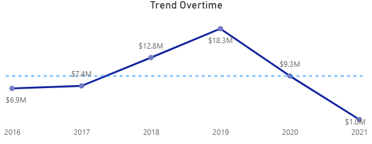
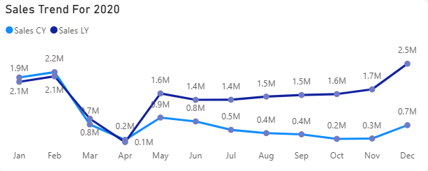
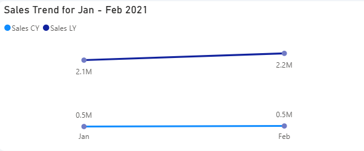
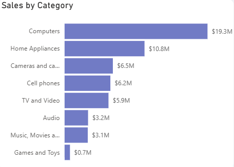
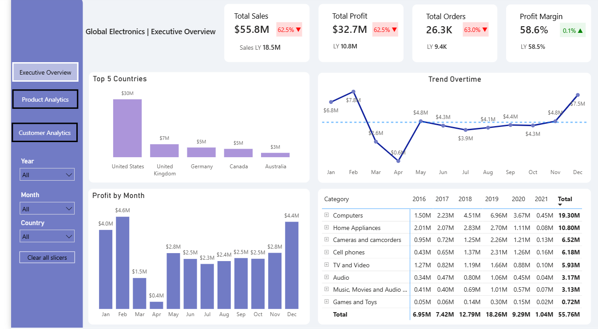
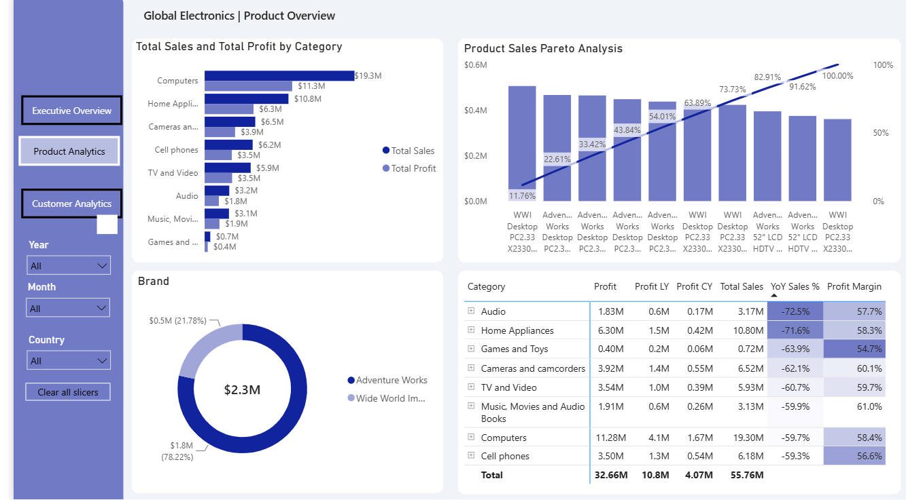
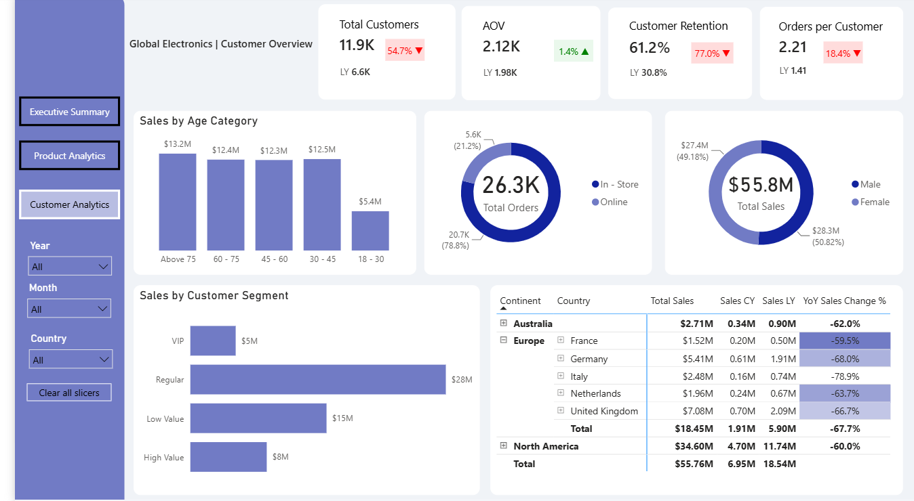

# 📊 Global Electronics Sales Analytics Dashboard

## 📌 Project Overview

**Global Electronics Sales Analytics Dashboard** is an end-to-end **Data Analytics and Business Intelligence project** built to analyze the sales performance of a Global Electronics retailer.
Global Electronics is a retail business with a diversified product portfolio and an international customer base. The company operates across multiple product categories, countries, and geographic markets.

**Computers are the company's strongest category, contributing roughly one-third of revenue**. Together, Computers and Home Appliances account for more than half of the company's total revenue, making these categories particularly important when evaluating overall business performance.

Global Electronics operates across multiple geographic markets, with sales distributed across North America, Europe, and Australia.

North America is the company's largest geographic market, generating approximately $34.60M in revenue. **The United States is the largest individual country market**, contributing approximately $29.87M, while Canada contributes approximately $4.72M.

The business is experiencing a **significant year-over-year decline in sales**, particularly in the most recent periods. This project focuses on understanding **where the decline is happening, which products and markets are most affected, how customer behavior is changing, and where the business can focus its recovery efforts**.

## 🎯 Business Problem

Global Electronics has experienced a substantial decline in sales performance compared with previous years.

Management needs to understand:

* How severe is the sales decline?
* When did the decline become significant?
* Which product categories are contributing to the decline?
* Which products and brands are losing sales?
* Which countries and markets are most affected?
* How has customer purchasing behavior changed?
* Is the decline affecting profitability?
* Which areas should management prioritize for recovery?

This dashboard provides a centralized analytical view to help answer these questions.

---

# 📈 Key Business Insights

### 🔻 Significant Year-over-Year Sales Decline

Sales performance has weakened considerably compared with previous years.

Key Note: Dataset is available for period Jan 2016- Feb 2021

* **2020 sales were approximately 49% lower than 2019**


 

* The latest 12-month period, **March 2020–February 2021**, generated approximately **$6.9M** compared with **$18.5M** in the previous comparable 12-month period.
* This represents an approximate **62% year-over-year decline** in the latest 12-month period.




* **January–February 2021 sales were approximately 75% lower than January–February 2020**
  


The trend indicates that the decline is not limited to a single month or isolated period, making further analysis of products, customers, and markets important.

### 📦 Product & Category Performance

Product-level analysis is used to identify:

* Categories experiencing the largest sales declines
* Products with weakening demand
* High-value products requiring attention
* Categories that continue to contribute significant revenue
* Potential products and categories for recovery initiatives

**Computers are the company's strongest category, contributing roughly one-third of total revenue. Together, Computers and Home Appliances account for more than half of total revenue.**



These categories are therefore particularly important when evaluating the company's overall sales performance.

### 🌍 Geographic Performance

Country and regional analysis helps identify:

* Markets experiencing the largest decline
* High-revenue markets requiring protection
* Geographic areas with potential recovery opportunities
* Differences in sales performance across regions

### 👥 Customer Performance

Customer analytics provides visibility into:

* Customer segments
* Customer purchasing behavior
* Average order value
* Orders per customer
* Repeat customer activity
* Changes in customer contribution to sales

This helps determine whether declining revenue is associated with **fewer customers, lower purchasing frequency, lower order value, or a combination of factors**.

### 💰 Profitability

Sales performance is analyzed alongside cost and profit metrics to understand whether declining revenue is also creating pressure on profitability.

This allows the business to distinguish between:

> **Revenue decline** vs. **profitability decline**

and prioritize actions that can improve both sales and business value.

---

# 🔎 Analytical Approach

The project follows a structured analytical process:

```text
Raw Business Data
       ↓
SQL Data Warehouse
       ↓
Data Quality & Validation
       ↓
Star Schema
       ↓
Power BI Data Model
       ↓
DAX Measures & Time Intelligence
       ↓
Interactive Dashboard
       ↓
Business Insights
       ↓
Recovery Recommendations
```

The analysis focuses heavily on **like-for-like year-over-year comparisons** so that business performance is evaluated over comparable periods.

For example:

| Analysis Period   | Comparison                             |
| ----------------- | -------------------------------------- |
| 2020              | 2020 vs 2019                           |
| Jan–Feb 2021      | Jan–Feb 2021 vs Jan–Feb 2020           |
| Mar 2020–Feb 2021 | Mar 2020–Feb 2021 vs Mar 2019–Feb 2020 |

This provides a more meaningful view of business performance than comparing periods with different lengths.

---

# 📊 Dashboard Pages

## 1. Executive Overview

Provides a high-level view of overall business performance.

### Key KPIs

* Total Sales
* Total Profit
* Total Orders
* Profit Margin
* Year-over-Year Sales Change
* Year-over-Year Profit Change
* Previous-Year Performance

### Visual Analysis

* Monthly Sales Trend
* Monthly Profit Trend
* Sales by Category
* Top Countries by Sales
* Year-over-Year Performance

**Purpose:** Quickly understand the overall health of the business and identify whether performance is improving or declining.

---

## 2. Product Analytics

Provides a detailed analysis of product and category performance.

### Analysis Includes

* Sales by Category
* Profit by Category
* Sales by Brand
* Product Performance
* Product Pareto Analysis
* Category Year-over-Year Performance
* Profit Margin by Category

**Purpose:** Identify products and categories that are contributing to the sales decline and determine where recovery efforts could have the greatest impact.

---

## 3. Customer Analytics

Analyzes customer behavior and customer contribution.

### Analysis Includes

* Sales by Customer Segment
* Sales by Age Group
* Sales by Gender
* Total Customers
* Average Order Value
* Repeat Customer Rate
* Orders per Customer
* Customer Sales Contribution
* Geographic Customer Analysis

**Purpose:** Understand whether changes in customer behavior are contributing to declining sales.

---


# 🏗️ Data Warehouse Architecture

The SQL Server data warehouse follows a **Medallion Architecture**:

```text
                Source CSV Files
                       │
                       ▼
              ┌─────────────────┐
              │  Bronze Layer   │
              │ Raw Data        │
              └────────┬────────┘
                       │
                       ▼
              ┌─────────────────┐
              │  Silver Layer  │
              │ Cleaned Data   │
              └────────┬────────┘
                       │
                       ▼
              ┌─────────────────┐
              │   Gold Layer   │
              │ Business Model │
              └────────┬────────┘
                       │
                       ▼
                  Power BI
```

### Bronze Layer

Stores the raw source data with minimal transformation.

### Silver Layer

Handles:

* Data cleansing
* Standardization
* Data type corrections
* Duplicate checks
* Data validation
* Transformation logic

### Gold Layer

Provides business-ready analytical tables optimized for reporting and Power BI.

---

# ⭐ Data Model

The Power BI model follows a **Star Schema**.

```text
                    Dim_Customers
                         │
                         │
Dim_Date ──────── Fact_Sales ──────── Dim_Products
                         │
                         │
                    Dim_Stores
                         │
                         │
                Dim_ExchangeRates
```

### Fact Table

**Fact_Sales**

Contains transactional information including:

* Order Number
* Order Date
* Delivery Date
* Customer Key
* Store Key
* Product Key
* Quantity
* Sales Amount
* Cost
* Profit
* Delivery Status
* Customer Segment

### Dimension Tables

* **Dim_Customers**
* **Dim_Products**
* **Dim_Stores**
* **Dim_Date**
* **Dim_ExchangeRates**

The star schema separates business events from descriptive attributes and provides an efficient structure for analytical reporting.

---

# 🧮 DAX & Time Intelligence

A major component of the project is the use of **dynamic DAX measures** for year-over-year analysis.

### Core Measures

```DAX
Total Sales = 
SUM(Fact_Sales[SalesAmount])
```

Additional measures include:

* Total Cost
* Total Profit
* Profit Margin
* Total Orders
* Sales CY
* Sales LY
* YoY Sales Change %
* YoY Profit Change %
* YoY Orders Change %
* Average Order Value
* Repeat Customer Rate
* Orders per Customer

### Dynamic Period Comparison

The dashboard supports different comparison scenarios, including:

* Full-year comparisons
* Partial-year comparisons
* Month-level comparisons
* Latest available rolling periods
* Same-period-previous-year analysis

This allows the dashboard to remain useful as different years, months, and reporting periods are selected.

---

# 🧹 Data Quality

Data quality checks were performed throughout the warehouse pipeline.

### Validation Includes

* Duplicate records
* Null values
* Data type validation
* Referential integrity
* Fact and dimension consistency
* Record-count validation
* Transformation validation
* Business-rule checks

The goal is to ensure that the numbers presented in Power BI can be traced back to validated warehouse data.

---

# 🐞 Problem Solving & Debugging

One of the important lessons from this project was that **unexpected Power BI results are not always caused by DAX**.

During development, a KPI was producing unexpected results because a hidden **Year filter/slicer** was affecting the report page.

The issue was resolved by inspecting the report's filter context rather than immediately rewriting the DAX.

### Key Lesson

> **When a Power BI result looks wrong, validate the filter context, model relationships, and visual configuration before assuming the DAX is incorrect.**

This project therefore demonstrates not only DAX development, but also practical **Power BI debugging and analytical validation**.

---

# 📁 Repository Structure

```text
Global-Electronics-Analytics/
│
├── Datasets/
│   ├── Customers.csv
│   ├── Data_Dictionary.csv
│   ├── ExchangeRates.csv
│   ├── Products.csv
│   ├── Sales.csv
│   └── Stores.csv
│
├── SQL/
│   ├── 01_Create_Database.sql
│   ├── 02_Create_Bronze.sql
│   ├── 03_Load_Bronze.sql
│   ├── 04_Quality_Checks.sql
│   ├── 05_Create_Silver.sql
│   ├── 06_Quality_Checks.sql
│   ├── 07_Load_Silver.sql
│   ├── 08_Create_Gold.sql
│   └── 09_Load_Gold.sql
│
├── Power BI/
│   ├── GlobalElectronics.pbix
│   ├── DAX_Measures.md
│   └── Data_Model.png
│
├── Dashboard_Screenshots/
│   ├── Executive_Summary.png
│   ├── Product_Analytics.png
│   ├── Customer_Analytics.png
│   └── Business_Insights.png
│
└── README.md
```

---

# 🖼️ Dashboard Preview

### Executive Overview



### Product Analytics



### Customer Analytics



---

# 🛠️ Technical Skills Demonstrated

### Data Engineering

* SQL Server
* T-SQL
* Data Warehouse Development
* Medallion Architecture
* ETL / ELT
* Data Transformation
* Data Quality Validation

### Data Modeling

* Star Schema
* Fact & Dimension Modeling
* Relationships
* Date Dimension
* Analytical Data Modeling

### Power BI

* Power BI Desktop
* Interactive Dashboards
* KPI Design
* Drill-down Analysis
* Slicers & Filters
* Data Visualization
* Report Design

### DAX

* Measures
* CALCULATE
* FILTER Context
* DATEADD
* DATESBETWEEN
* Time Intelligence
* Year-over-Year Analysis
* Dynamic Period Comparison
* KPI Logic

### Analytics

* Sales Analysis
* Profitability Analysis
* Customer Analytics
* Product Analytics
* Geographic Analysis
* Trend Analysis
* Business Performance Analysis
* Root-Cause Analysis
* Business Recommendations

---

# 🎯 Project Outcomes

This project demonstrates an end-to-end analytical workflow:

**Raw Data → Data Warehouse → Data Quality → Data Model → DAX → Dashboard → Insights → Business Recommendations**

The final solution provides management with a structured way to:

* Monitor declining sales performance
* Compare performance against previous periods
* Identify high-impact products and categories
* Analyze customer behavior
* Evaluate geographic performance
* Monitor profitability
* Prioritize recovery opportunities
* Track performance over time

The project demonstrates how **data analytics can move beyond reporting historical numbers and support practical business decision-making.**

---

# 📚 Key Learning

One of the most important lessons from this project was the importance of **analytical validation**.

A dashboard can contain technically correct calculations but still produce misleading business conclusions if the comparison periods are not equivalent.

Therefore, meaningful business analysis requires:

```text
Correct Data
     +
Correct Model
     +
Correct Filter Context
     +
Correct Time Comparison
     +
Business Context
     =
Reliable Insight
```

This principle was central to the development of the Global Electronics Analytics Dashboard.

---

# 👤 Author

**Ijas Ahamed**

* LinkedIn: https://www.linkedin.com/in/ijas-ahamed-a134aa123/
* GitHub: https://github.com/your-username

---

## ⭐ If you find this project useful

Feel free to explore the SQL scripts, Power BI model, DAX measures, and dashboard screenshots to understand the complete analytics workflow.
